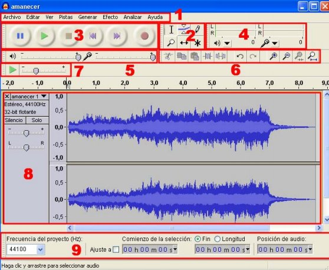
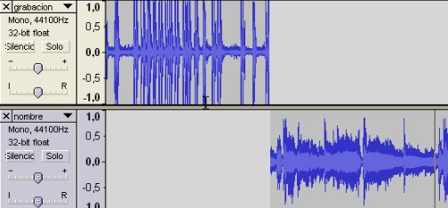

# 2.2.1 La grabación

Cuando grabes, ten en cuenta las siguientes **consideraciones**:

*   Ten el _volumen de los altavoces bajado_ para evitar el acoplamiento entre el micrófono y los altavoces.
*   _No hablar demasiado cerca del micrófono_. Averigua la distancia correcta haciendo pruebas.
*   _No tocar_ los cables ni jugar con el micrófono.
*   _Grabar al máximo nivel posible_ para enmascarar el ruido, pero sin traspasar la línea roja.
*   Evitar grabar de cara a una pared próxima para así _reducir la reverberación._

**El entorno del programa** es muy sencillo, con iconos y menús muy intuitivos. En la siguiente figura te detallamos los elementos indispensables para comenzar a grabar.

1.- **Barra de menús.** Se puede utilizar para activar cualquier opción del programa.

2.- **Barra de herramientas.** Contiene algunas de las operaciones de uso más frecuente:

3.- **Barra de control de reproducción**. Presenta los botones de grabación y reproducción.

4.- **Barra de medidores de Nivel de Entrada y salida**.

5.- **Barra de Mezclador.** Controla los niveles de salida y entrada de sonido.

6.- **Barra de Transcripción.** Permite iniciar la reproducción del audio y definir mediante el deslizador la velocidad a la que se reproducirá el audio

7.- **Barra de Edición.**

8.- **Pista de audio.**

9.-**Barra de Selección**

  
Te animamos a que “juegues” con la barra de herramientas y averigües las distintas funciones del menú. Por ejemplo:

Los **controles de grabación y reproducción** son los de toda la vida. Así, para iniciar la grabación es tan fácil como pinchar sobre el botón rojo de “_Grabar_”. Si quieres parar la grabación pincharás sobre el botón con el cuadrado en el interior. A partir de ese momento podrás seleccionar fragmentos para suprimirlos, crear efectos de sonido, duplicar, cortar, pegar, mezclar pistas, eliminar ruidos de fondo, etc.

\- Herramientas de desplazamiento de tiempo

pg. 9

\- Control para seleccionar grabación por micrófono

pg. 10

\- Botones del menú de editar: cortar, borrar, dividir sonidos, etc.

pgs. 17-19

De todas formas, para las necesidades más básicas de tu proyecto, te recomendamos que mires los siguientes **videotutoriales**: 

[funciones básicas](http://www.aularagon.org/Files/UserFiles/File/Internet_aula/INF_COMUNICACION/Tutoriales/audacity_demo/audacity_demo.htm "Funciones básicas Audacity")

Grabar 1 ó 2 pistas, eliminar fragmentos, crear efectos, etc.

[grabar y eliminar ruido](http://www.aularagon.org/Files/UserFiles/File/Internet_aula/INF_COMUNICACION/Tutoriales/AudacityEliminarRuido_demo/AudacityEliminarRuido_demo.htm "Grabar y eliminar ruido con Audacity")

Todos los pasos para eliminar ruidos, empezando por el micrófono

[crear una tira sonora](http://www.aularagon.org/Files/UserFiles/File/Internet_aula/INF_COMUNICACION/Tutoriales/AudacityTiraSonora/AudacityTiraSonora.swf "Crear tira sonora")

Cómo editar una sola tira sonora a partir de dos archivos diferentes.

Y si eres de los que les gusta más la lectura reposada, mírate el [tutorial](http://facilytic.catedu.es/2013/06/19/tutorial-audacity/ "Tutorial pdf Audacity")  en **pdf **de Daniel Primo sobre Audacity. Podrás encontrar información sobre:

*   Herramientas y espacio de trabajo  4,5
*   Grabar y cabecera de pista            9-11
*   Edición de las pistas                     12-15
*   Exportar                                     15

