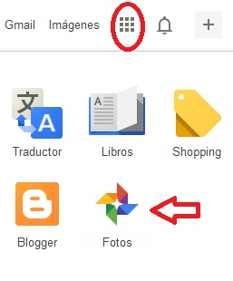

# 2.2.1 Google Fotos

 

En el mundo virtual  de Google están surgiendo muchas herramientas 2.0. Una de ellas es Google Fotos no vamos a ver todo, sólo aquello que interesa para desarrollar nuestra tarea: subir fotos, crear  y mandar álbumes.

Sigue los pasos del siguiente [tutorial](https://www.youtube.com/watch?v=tAEHQYI1B9g) y correrás el riesgo de convertirte en un forofo o forofa de Google Fotos.

**Recuerda** Para utilizar Google Fotos es imprescindible que tengas una cuenta de correo en [Gmail](https://www.google.com/intl/es/gmail/about/). Son tantas las herramientas 2.0 que te vamos a ofrecer a lo largo de este curso, que sólo nos conformamos con dos cosas: primera, que seas consciente de las posibilidades que hay en la "nube"; y, segunda, que **envíes al tutor tu cuenta de gmail.** Si no la tuvieras, pincha sobre el rectángulo rojo [CREAR UNA CUENTA](https://support.google.com/mail/answer/56256?hl=es) y vete escribiendo la información solicitada. Al final del proceso, no olvides escribir en algún sitio el nombre de usuario y la contraseña. Por si necesitas más ayuda pincha en el siguiente [tutorial para crear una cuenta.](http://facilytic.catedu.es/2013/10/09/crea-una-cuenta-de-gmail/ "Tutorial para crear una cuenta en gmail. ARgentina Trabaja")

Google Fotos ofrece muchas otras utilidades: sincronizar distintos dispositivos, copias de seguridad, edición de imagen, creación de collages o gifs, etc. Si quieres profundizar en algunas de esas funciones puedes consultar el este [tutorial](https://www.xatakandroid.com/foto-y-video/19-trucos-para-exprimir-al-maximo-google-fotos).

